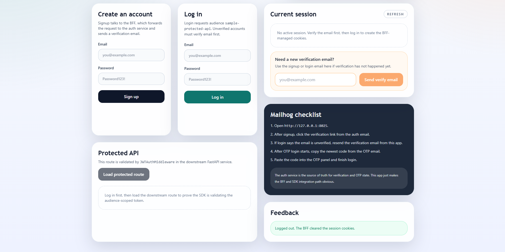

# authSDK Full-Stack Sample Template

This template demonstrates the browser-session integration model with a
published auth-service image and one SDK-protected downstream API:

- `frontend/`: React + TypeScript + Tailwind app served on one browser origin
- `protected-api/`: FastAPI downstream API protected by `auth-service-sdk`
- `compose.yml`: full local stack, including auth-service, Postgres, Redis, and
  Mailhog
- `backend/`: legacy token-mode BFF reference kept in the repo, but no longer
  used in the primary browser-session flow

The browser talks to one app origin only:

- `/_auth/*` is proxied to auth-service
- `/api/*` is proxied to `protected-api`

The auth service owns the `HttpOnly` access and refresh cookies. The frontend
reads only the CSRF cookie, and the downstream API validates the same browser
session through `auth-service-sdk`.



## Flows Covered

- email/password signup
- email/password login with browser-session cookies
- login OTP verification and resend
- refresh rotation through `POST /_auth/token`
- logout
- resend email verification before or after login
- enable login OTP
- one SDK-protected downstream route

Google OAuth is intentionally not included in this first version.

## Browser-Session Topology

```text
Browser
  |
  +--> http://127.0.0.1:5173/_auth/*  -> proxied to auth-service
  |
  +--> http://127.0.0.1:5173/api/*    -> proxied to protected-api
```

The browser never stores access or refresh tokens in JavaScript-managed
storage. The auth service sets the cookies itself, and the frontend attaches
the double-submit CSRF token on unsafe requests.

## Prerequisites

- Docker Desktop or Docker Engine with Compose
- Python 3.11+
- Node.js 18+
- `uv`
- internet access the first time you build the stack, so Docker can pull
  `ghcr.io/chintakjoshi/auth-service:v1.4.3` and `uv` can fetch the SDK source
  from the matching GitHub tag

## Quick Start With Docker

The default stack now pulls auth-service directly from GHCR:

- image: `ghcr.io/chintakjoshi/auth-service:v1.4.3`

Start everything from this repository root:

```powershell
docker compose up --build
```

Useful local URLs:

- frontend app origin: `http://127.0.0.1:5173`
- auth service: `http://127.0.0.1:8000`
- auth docs: `http://127.0.0.1:8000/docs`
- protected API debug port: `http://127.0.0.1:8200`
- Mailhog: `http://127.0.0.1:8025`

What the compose stack includes:

- `auth-service` from GHCR
- `postgres`
- `redis`
- `mailhog`
- `protected-api`
- `frontend`

The compose file uses sane local defaults, but you can still override values
such as `AUTH_SERVICE_IMAGE`, `APP__PORT`, `POSTGRES_PASSWORD`, or Mailhog
ports through a standard repo-root `.env` file if needed.

## Local Dev Split

If you want to run only the auth-service dependencies in Docker and keep the
frontend or protected API on your host:

1. Start the compose stack.
2. Run the protected API locally if desired:

```powershell
cd .\protected-api
Copy-Item .env.example .env
uv sync
uv run uvicorn app.main:app --reload --host 127.0.0.1 --port 8200
```

3. Run the frontend locally if desired:

```powershell
cd .\frontend
Copy-Item .env.example .env
npm install
npm run dev
```

Local development defaults still point at:

- auth service: `http://127.0.0.1:8000`
- protected API: `http://127.0.0.1:8200`

`protected-api/uv sync` now resolves `auth-service-sdk` from the public
`https://github.com/chintakjoshi/authSDK.git` repository at tag `v1.4.3`
instead of a sibling `../authSDK` checkout.

## How the Sample Works

1. The frontend bootstraps CSRF from `GET /_auth/csrf`.
2. Login and OTP verification go to `/_auth/*` with `credentials: "include"`.
3. The auth service sets the access and refresh cookies on the frontend origin.
4. The frontend calls `/api/me` and `/api/demo` through the same origin.
5. `protected-api` accepts the cookie-authenticated request and validates the
   session with `auth-service-sdk`.

Because the browser stays on one origin, this sample does not need frontend
code that stores or forwards raw access or refresh tokens.

## OTP + Mailhog Notes

- OTP emails and verification emails land in Mailhog.
- Use Mailhog to inspect the verification link and OTP codes.
- Password login is blocked until the account email has been verified.
- If you want to enable login OTP, verify the email address first.
- The sample UI can resend the verification email even before the first login.
- The default email verification links still point at the auth service on port
  `8000`, which is fine for this sample.

## Environment Files

- [frontend/.env.example](frontend/.env.example)
- [protected-api/.env.example](protected-api/.env.example)
- [backend/.env.example](backend/.env.example)

## No Sample Database

This template does not add its own application database. Auth state stays in
the central auth service, which owns Postgres and Redis inside the compose
stack.

More detail: [docs/docker.md](docs/docker.md)
